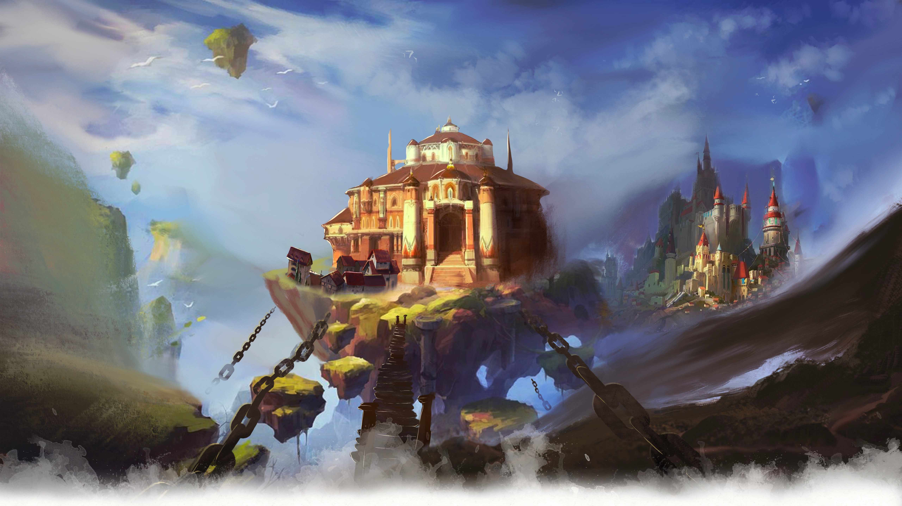
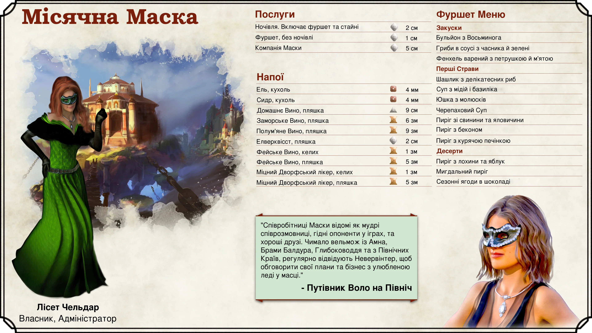
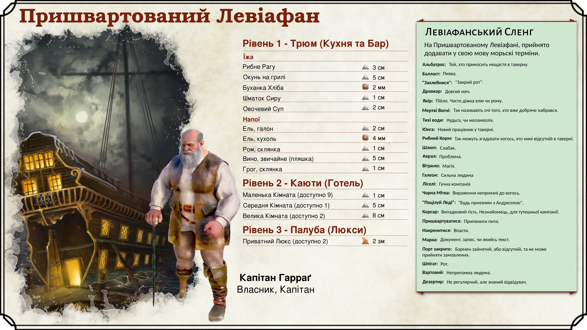
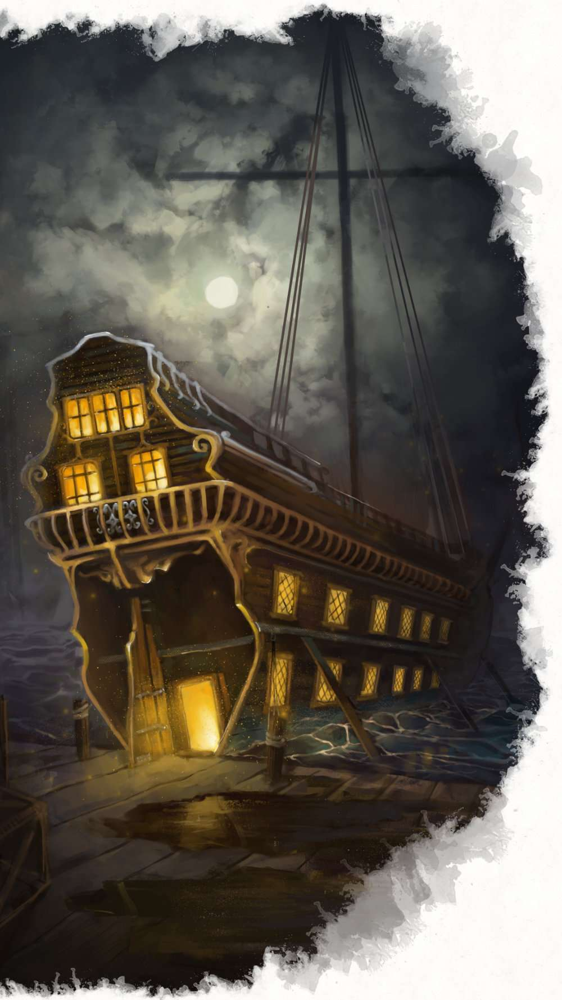
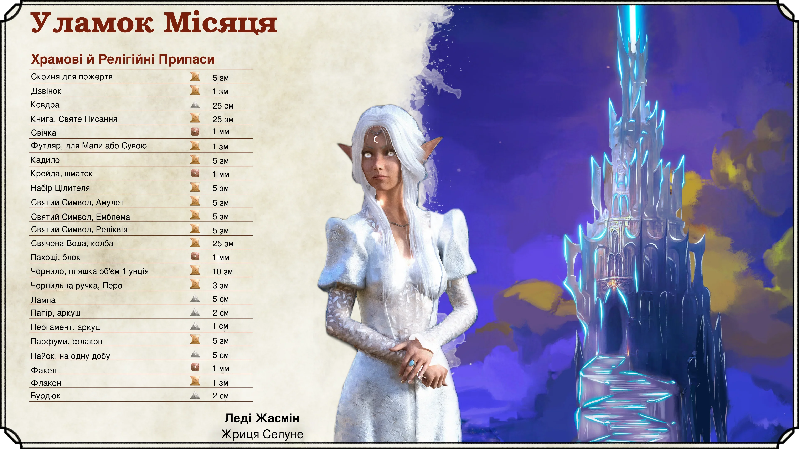
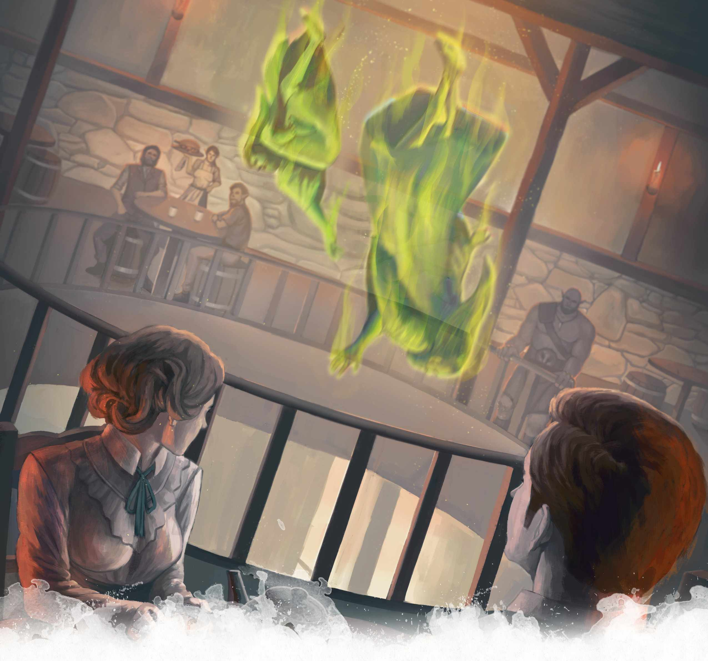
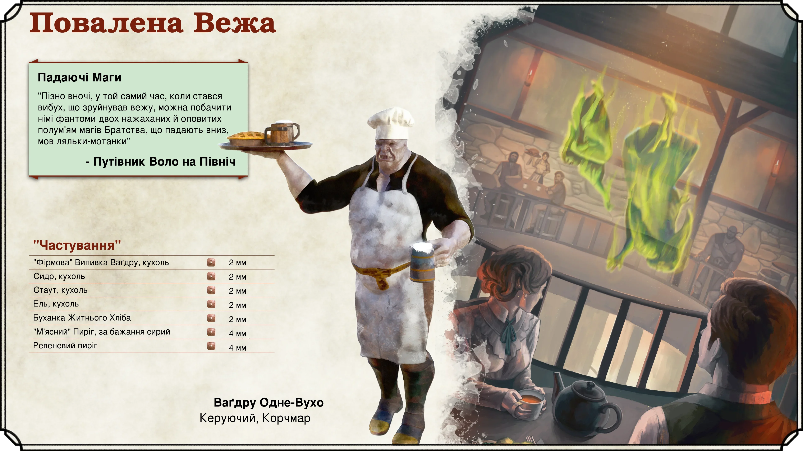

# Локації Невервінтера

## Замок Невер

{.print-only .print-bottom-right}

Замок Невер, що височіє над західною околицею міста, неможливо пропустити. Він розташований на скелястих рифах північного берега затоки, де зустрічаються Море Мечів та ріка Невервінтер. Навколо замку знаходиться кам'яне коло, з якого виходять три мости через річку: Міст Сплячого Дракона, Міст Крилатої Виверни, та Міст Дельфіна.

Замок розташований на межі районів Протекторського Анклаву, Невервінтерських Доків, та Синього Озера. Впродовж історії, Замок відносили до різних районів міста, але корректніше його розглядати окремо. Мости виконують важливу роль в міській інфраструктурі, забезпечуючи можливість переходу через річку й з'єднуючи Протекторський Анклав та Синє Озеро.

Що зовні, що всередині, замок знаходяться у занедбаному стані, роблячи споруду небезпечною для проживання. Нинішній де-факто лідер, Лорд Даґульт Нетліючий (Dagult Neverember), працює над його реставрацією.

#### Замок Невер: Підйом й Падіння

Відвідувач міста, може помітити що архітектура замку контрастує над загальною. Це тому, що насправді йому понад тисячу років. Його будівництво замовив сонячний ельф, Лорд Халует Невер, який завоював Іллуск в -10 DR (з руїн якого нині постало місто Лускан). А в 87 DR Невервінтер було засновано як місто. Ймовірно замок Невер було побудовано десь між цими двома датами.

Попри численні напади на місто й різноманітні катастрофи, Замок Невер продовжував стояти, являючи собою символ рішучості й слави Невервінтера. Втім, він не залишався незмінним. Можливо, найбільш значущою катастрофою для Замку, стала подія 1451 DR, відома як «[Катаклізм](history-of-neverwinter)». Вона вразила місто, й залишила більшу частину замку в руїнах вбивши всіх його мешканців, включно з місцевою владою. Й до нині, у Замку Невер можна зустріти духи загиблих.

(print-page)

#### Всередині Замку

Дослідження Замку усе ще є небезпечним. Авантюристи, що забажають його відвідати, на собі відчують "гостинність" нинішніх мешканців, й зіштовхнуться з купою небезпек, що викликані його пошкодженнями. Замок — це масивна споруда, що з верхівок веж до глибин катакомб, наповнена історіями. Він має ряд задукоментованих небезпечних зон:

- ***Атріум***. Нині входи у атріум заколочені, аби не пропускати всередину світло, й запобігти поширенні тліючого запаху на зовні. Він наповнений позолоченими клітками, зі скелетами екзотичних птахів. Тепер там живуть [міконіди](/monster/myconid-adult), які будуть нападати, та ласувати зловмисниками.

- ***Дзеркальна Зала***. Раніше це був довгий дзеркальний холл, де знать вдосконалювала свою ходу та поставу. Нині ж, будь-який смертний, що потрапить в цю залу, знайде магічну реконструкцію її руйнації. Уламки скла, й палаючої оздоби будуть летіти у кожного, хто пробуде тут надто довго.

- ***Невернеф***. Катакомби, названі ***"Neverneath"***, що можна перекласти як "Під Невером", сповнені магії яка змушує їх постійно змінюватись, утворюючи глухі кути, тунелі до інших місць, або двері, що при кожному відкритті ведуть у нову кімнату. Це створено для ув'язнення тут авантюристів, доти, доки ті не загинуть від виснаження, чи лап численних [горгулій](/monster/gargoyle), які тут мешкають.

- ***Сховище Дев'яти***. Ця гробниця є місцем відпочинку, для дев'яти охоронців королівського роду Невервінтера. Сховище складається із двох зал: зовнішньої, з вічнопалаючими смолоскипами, які освітлюють кімнату, й нежиттю, що чатує в тінях; та внутрішньою, що закрита гіганськими кам'яними дверима, з вирізьбленим символом Невервінтера. Відвідувачі, яким вдасться потрапити всередину, побачать дев'ять мармурових трун, що оточують трон. Якщо комусь вдасться тут відпочити, то прокинувшись, в них є шанс побачити духів дев'яти, що пильнують за ними.

(print-column)

#### Реставрація Замку Невер

Лорд Даґульт Нетліючий обрав відновлення Замку, своєю приорітетною ціллю. Це грандіозна мета, що займе роки, а то й десятиліття! Нетліючий вважає цю ініціативу гідним символом відродження величі міста.

Жахливо, але однією з перших частин замку, котрі *було* реставровано для практичного користування -- це його підземелля. Нетліючий розпорядився використовувати їх для утримання засуджених за важкі злочини. Місцеві прозвали це місце "Діри". Й кожного дня, опівдні, у Дірах відбуваються страти. Зазвичай через дві доби по тому, як ув'язнений туди потрапить.

|**Натхнення для Майстра**|
|---|
|***Крамарі-вбивці***. Відновлення Замку Невер коштувало високих податків для мешканців міста. Не дивно, що це обурило деяких впливових торговців. Лорд Даґульт Нетліючий знає про можливі спроби замаху, й доручає партії захистити себе, й усунути потенційних вбивць|
|***Сентиментальні Реліквії***. Нині вже літній дворянин, втратив кохану людину, пів віку тому. Він доручає партії увійти в замок, й знайти цінну, своєму серцю, реліквію, з тіла свого втраченого кохання|
|***Будівництво Стало***. Бригади, відповідальні за реставрацію замку, не працюють, доки той не буде очищено від привидів та інших почвар. Для цих цілей, Лорд Нетліючий регулярно наймає авантюристів. Однак цього разу, будівництво спинилося, т.я. команда наштовхнулася на магічний бар'єр, який неможливо подолати. Партія повинна відшукати спосіб вирішння цієї проблеми й відновлення будівництва.|
{.dmidea}

|**Детальніше**|
|---|
|*Acquisitions Incorporated*, p. 121 - 122, (5th Edition)|
|*Sword Coast Adventurer's Guide*, p. 51, (5th Edition)|
|*Neverwinter Campaign Setting*, p. 148 - 149, (4th Edition)|
|*Grand History of the Realms*, p. 59, 61, (3rd Edition)|
|*The North - Guide to the Savage Frontier - Cities and Civilizations*, p. 16 (2nd Edition)|
|*Volo's Guide to the North*, p. 134 (2nd Edition)|
{.references}

(print-page)

## Протекторський Анклав

### Зал Правосуддя

Зал Правосуддя це головний храм Тира, бога закону та справедливості. Високі кам'яні стіни, кремезні колони та величний купольний дах, роблять його вражаючою та жаскою спорудою, всередині якої достатньо простору, щоб туди помістились представники гіганських рас, таких як велетні чи дракони.

Зал Правосуддя був не лише храмом. Він виконував роль міського суду, де розглядались низькорангові справи (тобто ті, де звинувачені не були знатного роду, не мали громадянства, чи були звинувачені у вбивстві), й використовувався як місце для навчання та тренувань захисників храму в мистецтві володіння зброєю. Після смерті Тира, в кінці 1300-х DR, функціонування Залу майже повністю зупинилось.

Та навіть після того, як Тира нестало, містяни відмовилися проводити в храмі служби призначені іншим богам. Лиш коли Лорд Нетліючий прибув до міста, він встановив тут тимчасове святилище Торма, опираючись на близькість їх сфер впливу. Він також використовував храм як базу для своїх операцій в місті, й як особисту резиденцію. Усі ці дії, невервінтерці зустріли із осудом.

Лише з поверненням Тира, храм знову було освячено в його честь, а Лорд Нетліючий перебрався в приватну резиденцію. Мешканці міста високо оцінили відновлення Зали, й їх ставлення до Лорда значно поліпшилось. З поверненням Залу Правосуддя колишньої слави, він знову зайняв центральне положення (як фізично так і духовно) серед Протекторського Анклаву.

|**Детальніше**|
|---|
|*Sword Coast Adventurer's Guide*, p. 51, (5th Edition)|
|*Neverwinter Campaign Setting*, p. 140 - 141, (4th Edition)|
|*Volo's Guide to the North*, p. 133 (2nd Edition)|
{.references}

### Дім Знань

Дім Знань це, одночасно, бібліотека, та головний храм Огми у місті. Архітектурно, він вважається однією з найбільш вражаючих та красивих міських споруд -- з великою кількістю вікон та неймовірним арочним дахом. Всередині знаходиться безліч дорогоцінних записів, за багато віків, включно з актуальною урядовою документацією, оскільки наразі у місті немає адміністративних органів.

Як і багато інших будівель, Дім Знань був майже повністю знищений через виверження гори Хотеноу в 1451 DR. Однак, молодий Майстер Атлаваст врятував більшість цінних матеріалів, запечатавши внутрішнє святилище храму, з собою всередині. Хоч і у ізоляції, та Атлавасту вдалося пережити катаклізм, та врятувати бібліотеку. Однак через це він замкнувся в собі, й трохи поїхав дахом, присвятивши весь свій вільний час захисту й реорганізації бібліотеки. Доки той був під захистом, інші частини будівлі, займали різні фракції, включаючи демонопоклонницький культ Ашмадай. Та нині це вже в минулому.

Після запечатування Прірви, служителі Огми повернулись до храму й працюють над його відновленням. Великий Писар, суворий чоловік з залізною рукою та запальним характером, Співі Летенсон (*Spivey Liethennson*) нині керує реконструкцією Дому. Й хоча зовні споруду вже майже повністю відбудовано, всередині все ще кипить робота. Тим не менш, Дім Знань знову працює для тих, кому потрібні документи, знання, чи записи.

|**Натхнення для Майстра**|
|---|
|***Незручна інформація***. Гравці, що шукають якусь інформацію про місто чи його околиці, можуть спробувати відвідати Дім Знань. Однак деякі матеріали можуть бути недоступними чи прихованими, й для доступу до них, партії доведеться познайомитись з дратівливим характером Великого Писаря Летенсона, або з замкненим та надміру недовірливим Майстром Атлавастом. Вони обидва можуть спершу випробувати групу, перш ніж їй довіритися.|
{.dmidea}

|**Детальніше**|
|---|
|*Sword Coast Adventurer's Guide*, p. 51, (5th Edition)|
|*Acquisitions Incorporated*, p. 122, (5th Edition)|
|*Neverwinter Campaign Setting*, p. 144 - 145, (4th Edition)|
|*The North - Guide to the Savage Frontier - Cities and Civilizations*, p. 16 (2nd Edition)|
{.references}

(print-page)

{.size-cover .no-margin .print-only}

## Витаючі Острови

Однією з найчарівніших особливостей Невервінтера є його три великі літаючі острови. Чарівна Чума 1385 DR призвела до того, що по всьому Торилу почали відриватись й витати шматки землі. Працьовиті невервінтерці змогли прив'язати кілька таких мотузками, й не дати їм покинути Узбережжя Меча.

{.size-full .screen-only .before-next-page-header}

### Місячна Маска

Місячна Маска (*Moonstone Mask*) -- це велика корчма розташована на витаючому острові, який з'єднаний з доками Протекторського Анклаву. Багато хто вважає це місце найкращим на найрозкішнішим заїжджим двором міста. Заклад отримав свою назву через напівмаски, які носить персонал, котрі вистелено сяючими місячними каменями.

(print-column)

#### Персонал Маски

На перший погляд, хороші умови проживання, й вражаючий краєвид є тим, що приваблює гостей до Місячної Маски. Та насправді, головною родзинкою закладу є його персонал. Їх навчили бути вірними компаньйонами, та відмінними співрозмовниками. Від кожного можна очікувати ерудованих бесід й високих навичок у різноманітних іграх. Саме компанійськість робить Маску такою популярною серед знаті, протягом більш ніж ста років.

{.print-bottom-right .with-margin}

(print-page)

Раніше тут працювали лише жінки, та нині, хоч це й не так, увесь персонал залишається надзвичайно привабливим. Всі вони одягнені в чорне, носять маски оздоблені місячним каменем, та амулети. Втім, це все не просто уніформа. Маски надають здатність до Темно- та Інфразору, що дозволяє легко пересуватися мороком. Магічні амулети надають імунітет від читання думок та контролю розуму, що є важливим в умовах доступу персоналу до конфіденційної інформації. Крім того, амулети дозволяють телепатично зв'язатися з власником готелю -- важлива міра безпеки, на випадок нахабного чи небезпечного гостя.

Лісет Чельдар (*Liset Cheldar*), жінка напівельф, є нинішньою власницею Місячної Маски. Припускається, що вона є нащадком попередньої власниці, Офали Чельдарсторн. На відміну від Офали, яка була сильним магом, Лісет не володіє подібними силами. Лісет приємна жінка, що часто фліртує з клієнтами.

#### Зручності Маски

На пешому поверсі заїжджого двору знаходиться велика та затишна кімната для прийому їжі, що водночас є комфортабельною вітальнею з кремезним каміном. Решту поверху, займають кухні, де, для гостей, готують найвишуканішу їжу. З вітальні, до гостьових кімнат, ведуть масивні спіральні сходи. Залу наповнює невимушена атмосфера, яку створюють, приємні та ввічливі розмови.

Гостьові кімнати займають з другого по четвертий поверхи. Розміри номерів варіюються від одномісних кімнат, до просторих люксів, на верхніх поверхах. Про те, всі вони мають зручні ліжка й розкішні хутряні килими. Гості, що зупиняються в Масці, можуть розраховувати на те, що їжу включено у вартість проживання, але алкоголь доведеться оплачувати окремо. Воно й не дивно: Місячна Маска має вражаючий асортимент вишуканих напоїв.

Для гостей що подорожують крилатими скакунами, на даху є спеціальний майданчик. Кажуть, що Маска преповнена таємними проходами між кімнат, ввійти до яких можна промовивши певні магічні слова. Вони дозволяють персоналу потай пересуватись спорудою. На п'ятому поверсі розміщується жвавий фестиваль з музикою та танцями, а над ним, знаходяться пентхауси. Магічна звукоізоляція кімнат гарантує, що це нікому не заважатиме.

(print-column)

|**Натхнення для Майстра**|
|---|
|***Осередок Знань***. Лісет та персонал Маски, можуть володіти великою кількістю інформації та чуток про місто. І хоча конфіденційну ніхто з них не видасть, але не конфіденційною вони цілком можуть поділитися.|
|***Хороша Компанія***. Не рідко в Місячній Масці можна зустріти відомих постатей чи вельмож, в тому числі й самого Лорда Даґульта Нетліючого. Використовуйте цю локацію, як місце для примітних зіткнень.|
|***Добро у Підвалі***. В підвалі Маски, знаходяться сховища, наповнені різноманітними магічними предметами. Гравці можуть їх знайти, якщо непомітно туди проникнуть.|
{.dmidea}

(print-page)

#### Історія Маски

Місячну Маску збудувала Офала Чельдарсторн, маг і член ордену Багатозоряний Плащ. Вона ж створила маски та амулети, котрі носить персонал. Раніше ходили чутки, що до того як Маска злинула у повітря, під нею знаходилися таємні ходи, якими особливі гості могли таємно її відвідувати. Також говорили про наявність підземель, що сполучалися з підконтрольними дворфам районами Підморку.

Після виверження гори Хотеноу В середині 1400-х DR, мотузки, що тримали острів, обірвалися, й корчму занесло в Море Мечів. Після того, як вона кілька місяців дрейфувала морем, її нарешті повернули до міста, прикувавши міцними металевими ланцюгами. Але по тому, місто не змогло привабити вдосталь гостей, й Маска збанкрутувала, й кілька десятиліть була зачинена. Лиш після того, як Лорд Неверембер почав свій рух "Новий Невервінтер", за відбудову міста, Лісет Чельдар переконала того, що являється законною спадкоємицею Місячної Маски, й змогла отримати фінансування для її відновлення, до колишньої слави. У відповідь, заїжджий двір служив домом Нетліючого, його найманців й офіцерів протягом 1470-80-тих DR.

|**Детальніше**|
|---|
|*Neverwinter Campaign Setting*, p. 142 - 143, (4th Edition)|
|*Storm Over Neverwinter*, p. 8 - 11 (4th Edition)|
|*Volo's Guide to the North*, p. 138 - 140 (2nd Edition)|
|*The North - Guide to the Savage Frontier - Cities and Civilizations*, p. 16 - 17 (2nd Edition)|
{.references}

### Скайхолд Піратів

На північний захід від Невервінтера, серед Узбережжя Меча, знаходиться ще один Витаючий Острів, відомий як Скайхолд Піратів (*Pirates' Skyhold*). Невдовзі після Чарівної Чуми, група піратів, що володіла літаючим кораблем, захопили цей острів, й проголосивши його своєю власністю, збудували там дерев'яні укріплення.

Згодом форт спіткала таємнича трагедія, котра вбила більшість, якщо не усіх, піратів. Їх порожній літаючий корабель залишився моторошним нагадуванням, про минувші події. Ніхто точно не знає що саме сталося у Скайхолді, але в місті про нього ходить безліч чуток. Хтось стверджує, що форт захопив дракон, інші -- що його заселили Нітерійці (*Netherese*), а треті -- що острів переповнений привидами.

Також, подейкують, що на острові залишився піратський скарб. Відомо, що вони тягли туди награбоване, й з огляду на їх раптову загибель, припускають, що скарб повинен був залишитись десь на острові. Але потрапити на нього дуже не просто. Щоб дістатись цієї області, треба добути повітряний чи магічний транспорт.

|**Натхнення для Майстра**|
|---|
|***Відкрита Книга***. Відповідно до *Neverwinter Campaign Setting 4e*, Скайхолд Піратів умисне залишили таємничим й відкритим для Майстрів, аби ті могли створити там власну пригоду.|
|***Скарб Дракона***. Не секрет, що дракони полюбляють золото. Юний дракон міг атакувати Скайхолд, вбити всіх мешканців, й привласнити їхню здобич, як власний скарб.|
|***Зомбі Пірати***. Бог смерті Миркул був дуже активний у цій місцевості (див. [Dragon of Icespire Peak](https://www.dndbeyond.com/sources/doip) та трилогію [Beyond Dragon of Icespire Peak](https://www.dndbeyond.com/essentials/continue-the-adventure)). Невмерлі захопили острів, перетворивши його на форт проклятих. Під островом, на прив'язі, знаходиться Смертельний Лицар-Дредноут (*The Death Knight-Dreadnaught*).|
|***Візьму по одному із кожного*** Миркул наслав на Скайхлод [Драколіча](/monster/adult-blue-dracolich){.red} чи [Дракона-Привида](/monster/ghost-dragon){.red}. Відтоді він панує над армією невмерлих піратів, оберігаючи свої скарби!|
{.dmidea}

|**Детальніше**|
|---|
|1 - *Neverwinter Campaign Setting*, p. 148, (4th Edition)|
{.references}

### Рибальський Поплавок

Рибальський Поплавок -- це Витаючий Острів, що на південному-заході від Невервінтера, який місцева гільдія рибалок зробила своїм домом та офісом. Склади та будинки, що розкинулися на острові, доволі прості та скромні. Одного погляду на ці маленькі дерев'яні халупи вистачить, щоб зрозуміти, що рибалки та моряки, котрі тут мешкають, ведуть далекий від розкішного спосіб життя.

Й хоча жителі Поплавка постачають велику кількість морепродуктів у Невервінтер, все ж, тримаються від міста дещо ізольовано. Від того, про острів ходить багато чуток, найпоширенішою з яких є те, буцімто його мешканці живуть у якомусь союзі зі злими богами моря, та/або морськими чудовиськами.

|**Детальніше**|
|---|
|*Neverwinter Campaign Setting*, p. 148, (4th Edition)|
{.references}

(print-page-single-column)

## Невервінтерські Доки

{.size-full .screen-only .before-next-page-header}

### Пришвартований Левіафан

"Левіафан" був сумнозвісним піратським кораблем, що ходив уздовж Узбережжя Меча, жахаючи мореплавців. Капітан Левіафана, Гарраґ, був страшним ворогом кожному, хто зустрічав його в морі. Коли Гарраґ виходив на полювання, жоден моряк не мав певності, що його трюм у безпеці. Незадовго після виверження Гори Хотеноу, на півночі Невервінтера, Левіафан сів на мілину й пробив свій корпус. Замість аби покинути судно, Гарраґ залишився із ним, спостерігаючи як міські доки відбудовуються навколо нього (частина тогочасної реконструкції міста), й як розбите корито перетворюється на процвітаючий шинок.

{.image-beached-leviathan}

#### Ідучи Палубою

Корабель розділено на три гостьових рівні. У першому ("трюм"), куди можна потрапити з доків, знаходяться кухня та шинок. Тут є багато столів, для компаній різного розміру. Другий рівень ("каюти"), пропонує нічліг, даючи 12 кімнат на вибір. А на третьому ("палуба") знаходяться приймальні кімнати (*parlor rooms*) та столики. На вершині "палуби" є додаткова каюта, в якій мешкає Капітан Гарраґ. Між рівнями можна пересуватись спіральними сходами, що в центрі корабля. Крім того, підйомник, що працює на лебідці, може транспортувати вантажі через невеликий вал, який пронизує усі рівні.

Корабель прикрашено атрибутами морської тематики, багато з яких є трофеями із подорожей Гарраґа. Інтер'єр корабля й його меблі, є вишуканою й на совість зробленою роботою, з дуба та вишні. Тим не менш, за роки служби, відвідувачі зробили інтер'єр сильно зношеним.

#### Ром і Ватага

Клієнтами Левіафана, є різні, як правило, не заможні, верстви населення. Основними відвідувачами є моряки, але його відвідують і сухопутні мешканці Невервінтера. Проте, в корчмі раді будь-кому у кого є гроші. В таверні часто використовують морський сленг (на приклад називаючи п'яницю "балластом", чи звертаючись до новачка як "привратник"). Часто, в такі моменти, відвідувачі, що не виходили в море, губляться, не розуміючи про що йдеться. Азартні ігри та бійки тут не є рідкісним явищем, але за останє можуть і за борт викинути.

Також тут можна зустріти представників злочинності, контрабандистів, крадіїв, незаконних торговців. Для цих осіб, Пришвартований Левіафан служить важливим місцем для бізнесу. Тут укладають угоди, торгують, а випадковий п'яниця може потрапити в рабство. Все це добре відомо Лорду Нетліючому та його людям. За корчмою ведеться обережний нагляд, аби бути в курсі злочинних справ, хоч і в основному у них ніхто не втручається, залишаючи Левіафан надійним джерелом інформації.

(print-page)

#### Морські Товариші

Пришвартований Левіафан не міг би існувати без безстрашного капітана та відданої команди! Тут зібралася колоритна компанія з відвідувачів й персоналу, які роблять цей заклад таким цікавим. Доєднавшись до них, й ставши постійним відвідувачем таверни, ви, найімовірніше, також отримаєте влучне морське прізвисько.

***Капітан Гарраґ.*** Капітан -- кремезний, волохатий, одноногий чоловік (другу він втратив у бою з сахуагіном). Він має страшний та грубий зовнішній вигляд, але його близькі знають, що він володіє вражаючою кількістю співчуття та емпатії. Пришвартований Левіафан -- результат любові й відданої праці капітана, й він ним надзвичайно пишається. Втім, не варто його недооцінювати. Гарраґ не впустить вигідної, для себе, угоди, навіть якщо та, вимагатиме від нього жорстокості, й каратиме тих, хто загрожує його закладу.

##### Персонал ("Екіпаж")

***Андрелла*** "Приятелька" - Андрелла права рука Гарраґа. Людська жінка середнього віку, яка є головною барменшею (крім неї, за баром стоять Жизерія, Сандрін, та Віллоу). Вона дуже піклується про капітана, й керує персоналом, коли той відсутній. Жінка приховує своє нерозділене кохання до Гарраґа.

***Фенґ*** Чималий чоловік напів-орк. Працює охоронцем.

***Табнаб*** Дивакуватий людський чоловік. Повар.

##### Відвідувачі

***Лен-жес.*** "Капітан Порту" - Лен-жес покрита шрамами водяний дженазі. Вона реально є капітаном порту Невервінтера. Час від часу винаймає кімнату в Пришвартованому Левіафані.

***Умі*** "Рульова" - Умі також водяний дженазі. Вона двоюрідна сестра Лен-жес. Вправно володіє мечем, й може замінити або допомогти Фенґу, якщо ситуація в закладі вийде із під контролю.

***Бобрик Дужий-Плащ*** "Боцман" - Бобрик (*Bobrik Highmantle*), кремезний дворф з ручною мавпою, є постійним гостем у барі. Має запальний темперамент, через що, часом, його можуть вигнати з таверни на кілька днів.

***Маркул*** "Караульник" - Маркул молодий людський хлопець, що прислухається до всього що відбувається у таверні. Він готовий, за певну ціну, поділитись почутими секретами, якщо це не зашкодять Левіафану.

***Еттейн*** "Конопатник" - Еттейн, чоловік напів-ельф, що працює в корчмі різноробочим. Він вмілий тесля, й часом лагодить корабель, або меблі. Знає кожен дюйм Левіафана, включаючи найпотаємніші закутки.

***Корін*** "Шантимен" - Корін це драконороджений бард, середніх років. Водночас і музикант, і виконавець. Часто спонукає увесь бар співати морських шантів, або народних пісень. Із задоволенням бере чайові, й дармову випивку. Його родину вбили сектанти, що, часом, схиляє його до скорботних пісень.

(print-page)

#### Бурхливі води

За свою коротку історію, Пришвартований Левіафан не раз опинявся втягнений у конфлікти, що виходили за межі його видимо-скромної ролі. Цьому, значною мірою, сприяє контингент Левіафана, й причетність до нього Лорда Нетліючого. Власне, саме завдяки його підтримці, Гарраґ взагалі зміг відкрити свій заклад, адже Лорд знищив усі записи про злочини капітана у відкритому морі, чим заслужив його прихильність. В дійсності ж Нетліючий використовує Гарраґа. Ба більше, він зайшов у цьому на стільки далеко, що, у шпигунських цілях, обернув тінь капітана на розумну істоту.

В 1479 DR, під час боротьби за трон Невервінтера й втрачену корону Алаґондару, Левіафан був атакований. Його врятували люди Нетліючого: найняті ним авантюристи й його головний полководець Генерал Сабін. Згодом, того ж року, культ Ашмадай (*Ashmadai*) та їх демони проникли на корабель, й вбили одного з радників Сабіна. Це була частина іншої, більшої змови, могутнього мага Елдена Варґаса, з метою здобути й використати сили Асмодея.

|**Детальніше**|
|---|
|*Dungeon*, Issue #193, p. 79 -83, (4th Edition)|
|*Neverwinter Campaign Setting*, p. 154-155, (4th Edition)|
|*Lost Crown of Neverwinter*, p. 18 - 19, (4th Edition)|
|*Storm Over Neverwinter*, p. 17 - 18, (4th Edition)|
{.references}

### Таверна Дріфтвуд

Елітна та дорога Таверна Дріфтвуд (*"Driftwood" - "Корчі"*) знаходиться в північній частині міських доків. Нині, більше музей ніж таверна, вона є одним з найстаріших місць де можна випити, адже існувала ще за часів до Чарівної чуми 1385 DR. Після катаклізму 1451 DR вона служила притулком для біженців, а потім, тимчасовою ратушею, доки місто оговтувалось.

Заклад переповнено різним антикварним добром. Можна було б, навіть, назвати його неорганізованим, чи захаращеним, та натомість, більшість відвідувачів бачать у ньому "Старий Невервінтер", місце де зберігається історія міста. Багато мандрівників платять високі кошти більшою мірою не аби тут заночувати чи попоїсти, а щоб насолодитись місцевими реліквіями.

Закладом керує 70-ти літня мадам Розен. В 1479 DR група повстанців, відомих як Сини Алаґондару виступали проти правління Лорда Нетліючого. Вони розділилися на дві фракції: Нешери, лідером яких був Арлон Блейдшейпер та Сірі Плащі, яких потай очолювала Розен. Нині їх конфлікт із Нетліючим вже в минулому, й багато колишніх повстанців навіть вступили у армію міста (більшою мірою вважаючи, що ліпше самостійно контролювати порядок у Невервінтері, ніж віддавати це в руки найманцям Мінтарна). Мадам Розен, є джерелом знань про історію міста, й з задоволенням побалакає про старі добрі часи.

|**Детальніше**|
|---|
|*Sword Coast Adventurer's Guide*, p. 52, (5th Edition)|
|*Neverwinter Campaign Setting*, p. 154-155, (4th Edition)|
{.references}

### Торговий Дім Тармалуну

Торговий картель з міста Тармалун, придбав великий складський комплекс у південних доках Невервінтера, а за їх межами, розмістив багато різноманітних крамниць. Тармалунські купці жадають закріпити свій вплив у цьому районі, аби потистояти своїм конкурентам з міста Лилорн, котрі нещодавно розгорнули свій бізнес в сусідньому Лускані

|**Натхнення для Майстра**|
|---|
|***Не буває безкоштовної швидкої доставки***. Якщо ваші гравці хочуть прдбати щось специфічне чи унікальне, очікувано що велика торгова мережа Тармалуна, могла б знайти цей предмет. Але це коштуватиме чималих грошей, та займе якийсь час. Зрештою, подорожі Торилом займають багато часу й ресурсів. Не кажучи вже про ризик.|
{.dmidea}

|**Детальніше**|
|---|
|*Neverwinter Campaign Setting*, p. 147, (4th Edition)|
{.references}

(print-page)

{.print-only .print-top-left}

(print-column)

## Район Веж

{.size-full .screen-only .before-next-page-header}

### Уламок Місяця

Уламок Місяця, що раніше звався "Уламок Ночі", це витаюча вежа, розташована в одноіменному районі міста. Вона пройшла вражаючу подорож крізь Матеріальний та Тіньовий Плани.

Вежа почала своє існування як частина Залу Тіні Місяця в місті Яунн, що більш ніж за тисячю миль від Невервінтера. В кінці 14-го століття DR, Шадовари (мешканці плану Тінепад, й одні з небагатьох представників Нетерезів, що ще лишилися) напали на храм, вирвали, своєю магією, одну з його веж, й відправили ту в Тінепад. З'ясувавши, що вони можуть матеріалізувати її будь-де у королівствах смертних, вони розмістили її в Невервінтері, під час Чарівної Чуми. Таким чином, Нетерези могли використовувати портал що був у ній, для переміщення між Ксинленалем та Невервінтером.

Вежа була чорною й не відкидала тіні. Це було наслідком магічних маніпуляцій, спрямованих на поглинання тіні, й перетворення її в енергію, що живила телепортаційні пристрої. Невервінтерці, здебільшого, уникали зловісної й лячної вежі, що височіла над головою. Не в останню чергу тому, що всі хто наважувався увійти всередину більше не повертались.

{.print-bottom-right}

(print-page)

У 1479 DR, група авантюристів відбила вежу, дозволивши жрецям Селуне провести обряд очищення, й повернути їй алебастрово-білий вигляд. Тепер, ночами, якщо розмістити у вежі, чи під нею, три магічних уламки -- з'являться магічні сходи створені з суцільного місячного світла, котрими можна потрапити всередину. Втім, жреці допускають тули лише довірених осіб, але якщо героям вдасться її відвідати й там відпочити -- вони отримають додатковий сплеск зцілення до наступного тривалого відпочинку.

|**Детальніше**|
|---|
|*Dungeon*, Issue #193, p. 57 - 78, (4th Edition)|
|*Neverwinter Campaign Setting*, p. 158, (4th Edition)|
{.references}

### Плащева Вежа

Плащева Вежа -- магічна споруда, що служила цитаделлю та місцем для зустрічей Ордену чаклунів, що звали себе Багатозоряний Плащ. Довгі роки її було окуповано орками, та нещодавно Орден повернув її в свою власність.

#### Зникле Укріплення

В 1385 DR, під час Чарівної Чуми, вежа й усі хто знаходилися всередині -- щезли. Через пів року, загадковим чином вона повернулась у Невервінтер, хоч і на інше місце. Невідомо, що стало з чаклунами -- від них не лишилось і сліду.

Ходили чутки, що в Плащевій Вежі, все ще знаходиться магічний пристрій під назвою "Універсальний Фантограф Галавара" знайдений в нетерезьких руїнах. Повідомлялося, що він міг дублювати будь-які металеві предмети, чий розмір був "як великий трон, або менше", що також включало монети. Тож не дивно, що одразу по поверненні, туди вторглася група мародерів.

Вони не знайшли ні магічний пристрій, ні чаклунів, ні тіл. Лиш кольорові плащі, загадково звисали із вішаків. Та раптом, вони ожили, напали на непроханих гостей, й задушили їх. Врятувався лише один, який і оповів про побачене.

#### Вторгнення Орків

Багатостріли -- плем'я орків, які проникли у вежу й заволоділи нею. Містяни припускали що залишки магічного захисту Багатозоряного Плаща, переб'ють їх як і мародерів. Але ті, здавалося, не зустріли взагалі жодного опору, й змогли втримати вежу.

Лорд Нетліючий мирився з їх перебуванням у цьому місці. В основному тому, що не міг з цим нічого вдіяти: вежа була однією з найбільш укріплених споруд міста, через що йому лишалося тільки чекати та сподіватись на слушну нагоду. На щастя, Багатостріли самі її звільнили, так як вирушили на схід, на допомогу своїм побратимам у битві із дворфами.

Згодом знову активізувався Багатозоряний Плащ. Окремі члени Ордену співпрацювали з Лордом Нетліючим, сприяючи безпеці у регіоні. Передбачається, що нині Плащева Вежа знову належить їм.

|**Детальніше**|
|---|
|*Sword Coast Adventurer's Guide*, p. 51 (5th Edition)|
|*Storm Lord's Wrath*, sec. *House of Thalivar* (5th Edition)|
|*Neverwinter Campaign Setting*, p. 120, 157 (4th Edition)|
|*Volo's Guide to the North*, p. 134 (2nd Edition)|
{.references}

{.print-bottom-right .with-margin}

(print-page)

{.size-cover .no-margin .before-next-page-header .print-only}

{.size-full .screen-only .before-next-page-header}

### Повалена Вежа

Повалена Вежа -- це таверна збудована на руїнах чаклунської вежі. Вона має унікальну нічну "виставу", яка робить це місце популярим вже понад сто років.

#### Історія Вежі

За кілька десятиліть до Чарівної Чуми, вежа належала чаклуну на ім'я Лломнавель Олодхін, на прізвисько "Вогнерукий" (*Llomnauvel "Firehands" Oloadhin*). Він тримав у себе багато магічних дрібниць, на котрі кинули оком Братство Аркейн. Однієї ночі, Братство атакувало вежу, з метою пограбувати та захопити Олодхіна. Втім, він передбачив можливе вторгнення, й встановив у своїй оселі багато різних магічних пасток (як от чари, що перетворювали порушників на морських істот). Однак, йому не вдалось зупинити напад. Вежею прокотилась жорстока баталія, в ході котрої, не бажаючи віддавати вежу й своє добро, Олодхін використав потужну магію, яка зруйнувала вежу. Її, як і всіх хто був всередині (включно з господарем), поглинуло магічне полум'я.

(print-page)

#### Нічна Вистава

Магія залишила відбиток на місці, де була Олодхінова вежа. Від тоді, кожної ночі, рівно в той самий час, коли він викликав вибух, на цьому місці з'являється мовчазне магічне видіння, що зображує останні миті життя нападників. Як ті палають, падають та розбиваються. Закриває видовище Надчарівник Братства, падіння якого супроводжується трансформацією його кінцівок у вугрів.

Ця, здавалося б, нешкідлива магічна проекція, водночас жахала та захоплювала народ. Тож не дивно що знайшлись ті, хто зумів перетворити це трагічне видовище на розвагу. Вежу відбудували в таверну. Область видива відгородили розставивши навколо неї столи, таким чином, щоб відвідувачі, потягуючи свої напої, могли спостерігати "виставу". І хоча це було цікаве місце, як для місцевих, так і для гостей міста, з часом таверна заслужила репутацію місця з поганим пійлом й завищеними цінами. Це, в поєднанні з численними катастрофами, що вразили Невервінтер в 15-му столітті DR, її розорило, залишивши ту на довгі роки покинутою.

{.print-bottom-left .with-margin}

(print-column)

#### Під Новим Управлінням

Коли плем'я Багатострілів проникло у Район Веж, вони розграбували таверну. Якоїсь ночі, коли ті розпивали чергову бочку вина, прямо посеред гулянки з'явилося видиво, що до смерті налякало орків, вигнавши тих із будівлі. Втім, набравшись сміливості, згодом вони зрозуміли, що проекції їм ніяк не нашкодять, й повернулися в Повалену Вежу.

Завзятий одновухий орк, на ім'я Ваґдру Одне-Вухо, взяв її в свої руки, відкривши таверну вдруге. Лорд Нетліючий та керівництво Багатострілих заключили взаємну угоду, відповідно до якої, Повалена Вежа є нейтральною територією між орками й іншими расами міста. Від тоді кожен охочий може насолодитися скромними пропозиціями таверни. А будь-який порушник миру, зіштовхнеться із гнівом постійних відвідувачів. В корчмі подають недорогі, але задовільні вино та ель, а невідомого походження м'ясо, готують на відкритому полум'ї. Імовірно, коли Багатостріли покинули місто, Ваґдру залишився в Невервінтері.

|**Натхнення для Майстра**|
|---|
|***Технічні Збої***. Щось йде не так, і, раніше безпечні, нічні видива, раптом стають реальними, а магічне полум'я обпікає відвідувачів. Ваґдру просить авантюристів знайти спосіб втримати магію, щоб його бізнес не розвалився.|
|***Дипломатична Недоторканність***. Повалена Вежа -- ідеальне місце для зустрічі гравців з менш шанованими й небезпечними расами Фейруну|
|***Інше Біле М'ясо***. Ваґдру дає завдання на вбивство рівневих монстрів (скажімо [Гіганських Павуків](/monster/giant-spider){.red}, або [Сибриксів](/monster/sibriex){.red}), й принести їх туші як доказ. До жаху авантюристів, ці туші підуть на м'ясо|
{.dmidea}

|**Детальніше**|
|---|
|*Neverwinter Campaign Setting*, p. 157, (4th Edition)|
|*Volo's Guide to the North*, p. 135 - 138 (2nd Edition)|
|*The North - Guide to the Savage Frontier - Cities and Civilizations*, p. 15 - 16 (2nd Edition)|
{.references}

(print-page)

## Район Синього Озера

Район Синього Озера (*Bluelake*), що в минулому звався Районом Чорного Озера (*Blacklake*), був домом для більшості дворян Невервінтера. Після катаклізму, багато хто з них загинув, залишивши пустувати свої маєтки, котрі, завдяки своїй міцній конструкції, більшою мірою встояли. З часом це послужило хорошим підґрутням для того, щоб в цьому районі закріпилося багато підпільних та не законних організацій.

Відновлення занедбаних маєтків, здалось Лорду Нетліючому, хорошою можливістю, але варто було йому туди сунутися, як проти нього та його найманців виступили, немов, усі злочинні фракції міста.  Від Синів Алаґодара, до Мертвих Щурів, здавалося кожен хто мав проблеми з законом, перебрались у цей район. Через це, відвідувати Синє Озеро в ті роки було надзвичайно небезпечно. Про те нині, ситуація значно поліпшилася.

### Озеро

В минулому Синє Озеро, звали "Чорним". Воно знаходиться в центрі, названого в його честь, району. Влітку тутешній рівень води сильно опускається, демонструючи болотисте дно, але коли її достатньо, тут, іноді, навіть катаються на човнах.

Після виверження Хотеноу, через осівший попіл, озеро стало ще більш забрудненим. Його відновлення Лорд Нетліючий зробив однією зі своїх цілей, й після його поглиблення та очищення, "Чорне Озеро" перейменували на "Синє".

|**Детальніше**|
|---|
|*Neverwinter Campaign Setting*, p. 153 - 154, (4th Edition)|
|*Lost Crown of Neverwinter*, p. 33, (4th Edition)|
{.references}

### Будинок Тисячі Лиць

Будинок Тисячі Лиць -- це комфортабельна таверна в Районі Синього Озера, з пишними та зручними меблями, де невервінтерці часто люблять приємно потеревенити. Споруда колись служила крамницею одягу для заможних містян, й до нині повна дзеркал та манекенів, на яких досі красуються, уже застарілі стилі одягу. Власне манекени та їх відзеркалення й подарували назву "Тисяча Лиць".

Її підвал служить таємним місцем для зустрічі місцевих Арфістів. Арфісти, це, як правило, організація що виступає "за все хороше", й за збереження історії. Вона має особливо складну історію в Невервінтері, т.я. їх репутація в місті була підірвана, коли один з її посадовців виявився подвійним агентом в посередництві між Лордом Нетліючим та Синами Алаґондару (котрі виступали проти його правління).

|**Детальніше**|
|---|
|*Neverwinter Campaign Setting*, p. 153 - 154, (4th Edition)|
{.references}

## Район Прірви

### Запечатана Прірва

Під час виверження Хотеноу, в південно-східній частині міста виник величезний пролом, прямо в Підморок, де ще з часів Чарівної Чуми, залишились заражені землі. З цієї прірви, назовню, почали вилазити різні надприродні почвари, для захисту від яких, навколо регіону було збудовано величезну стіну. Кожен, хто її перетинав й наближався до урвища, відчував тривогу, та інші неприємні для психіки наслідки.

Не аби якими зусиллями, й чималим коштом, але з допомогою потужної магії, Нетліючий зумів її запечатати. І хоча проблему було вирішено, сам район лишився лежати в руїнах, тож його визнали вільним для обжитку. Будь-хто міг тут поселитися, й претендувати на земельну власність. Й сміливі поселенці, особливо надто бідні, щоб оселитись деінде, стікаються до Району Прірви, щоб збудувати собі тут нове життя.

|**Детальніше**|
|---|
|*Sword Coast Adventurer's Guide*, p. 52 - 53, (5th Edition)|
|*Neverwinter Campaign Setting*, p. 159 - 164, (4th Edition)|
{.references}

## Невердеф

Невердеф (*Neverdeath*) -- міське кладовище. Воно розділене на дві основні секції. Південно-західна, Жебрача секція, в основному наповнена рядами скромних безіменних могил тих, хто гинув в численних катаклізмах які спіткали Невервінтер. В іншій секції знаходяться складні мавзолеї, де спочивала шляхта й багатії.

Обидві секції вразила Чарівна Чума. Крім фізичної зміни місцевого ландшафту, поховані тут колись трупи тепер повертаються до життя й атакують відвідувачів. Й хоча високі стіни та охорона захищають від них містян, невервінтерці стараються триматись подалі від кладовища. Нині мешканці Невервінтера, кремують померлих.

|**Детальніше**|
|---|
|*Neverwinter Campaign Setting*, p. 145, (4th Edition)|
{.references .screen-only}