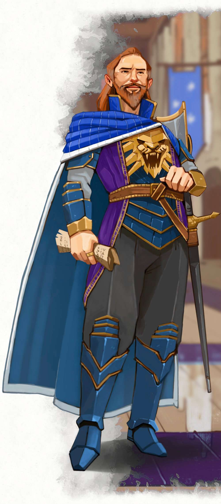

{.image-neverember}

# Лорд-Протектор Нетліючий

Даґульт Нетліючий, Лорд-Протектор Невервінтера, є фактичним лідером міста. Це складний персонаж що часто стоїть на межі між альтруїзмом й корисливістю. Свої, відверто сміливі, плани, він втілює з холодним прагматизмом. Його характеризують як людину амбітну, а ті хто мав честь говорити із ним віч-на-віч, описують чоловіка як впевненого та харизматичного.{.no-fancy}

Даґульт народився в 1429 DR в Невервінтері, й ще з юного віку прагнув створити з міста торгову імперію. Але пізніше переїхав в Глибоководдя, де одружився на заможній жінці Алетеї Брандарт, з якою у нього з'явився син, котрого назвали Ренейр (*Renaer*). Коли хлопчик був ще малюком, Алетея померла, залишивши всі свої статки у спадок сину а не чоловіку, що вплинуло на їхні стосунки. Втім, зрештою, ще до того, як йому виконалося 50, Нетліючий отримав високий титул Публічного Лорда Глибоководдя (*Open Lord of Waterdeep*), на посаді якого повернув місту колишню славу, після десятиліть корупції та занепаду.

Проте, весь цей час, Нетліючий розробляв плани щодо відновлення рідного Невервінтера. Задача складна: безліч руїн після виверження Хотеноу; на півдні здоровенне урвище, що постійно вивергає різних тварюк; північ уже окупували орки, не кажучи вже про беззаконня. Втім у руйнації, чоловік бачив можливість. Чистий лист. Тож він залучив свої зв'язки й статки, для найму людей, котрі допомогли б йому очистити та відновити Невервінтер.

Спроби захопити контроль над містом, однак, зіштовхнулися з опором. Різні фракції, як тіньові, так і публічні, протистояли Нетліючому. Оскільки вся королівська родина загинула під час катаклізму -- йшли битви за трон, які вдалось втихомирити, коли Нетліючий заявив що є бастардом колишнього короля Нашера Алаґондара. Містяни, втім, виражали невдоволення, оскільки почувалися в окупації через найманців Нетліючого. Й доки той докладав зусиль над відновленням Невервінтера, Приховані Лорди Глибоководдя, через надмірні трати, зняли його з посади Публічного Лорда.

Й хоча його це обурило, звільнення дозволило присвятити всього себе Невервінтера. Переїзд в місто, робота над його реконструкцією, й попередні заслуги Нетліючого, швидко поліпшило ставлення до нього у громадян. Багато колишніх ворогів тепер будують із ним взаємовигідні відносини. Він осідає в недорогій віллі, чим демонструє скромність, й починає роботу над відновленням замку Невер. А ті рідкісні дурні, що сміють заявляти що є спадкоємцями Алаґондара, швидко та тихо зникають, як тільки про них з'являється хоча б чутка.