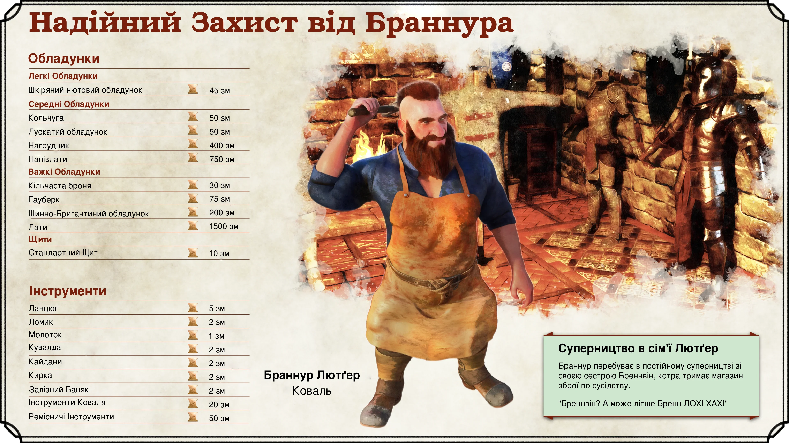
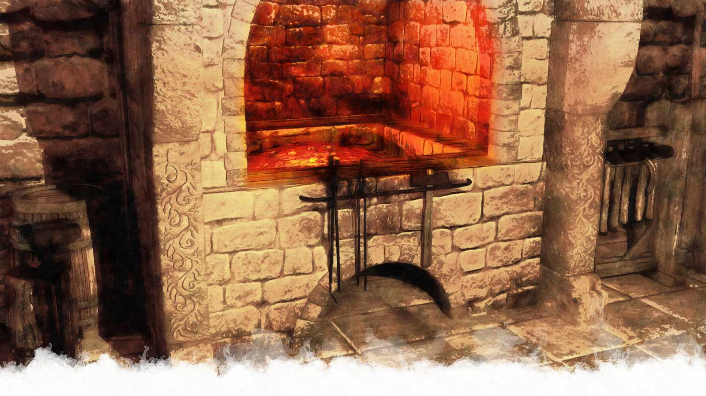
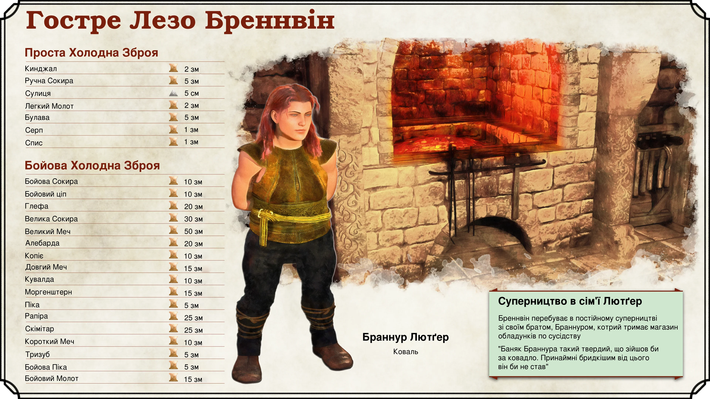
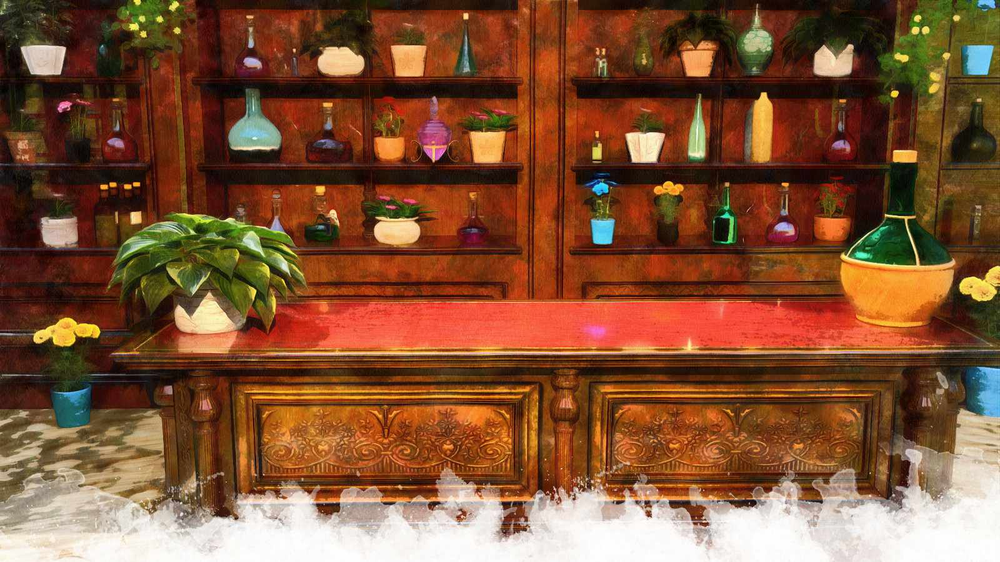
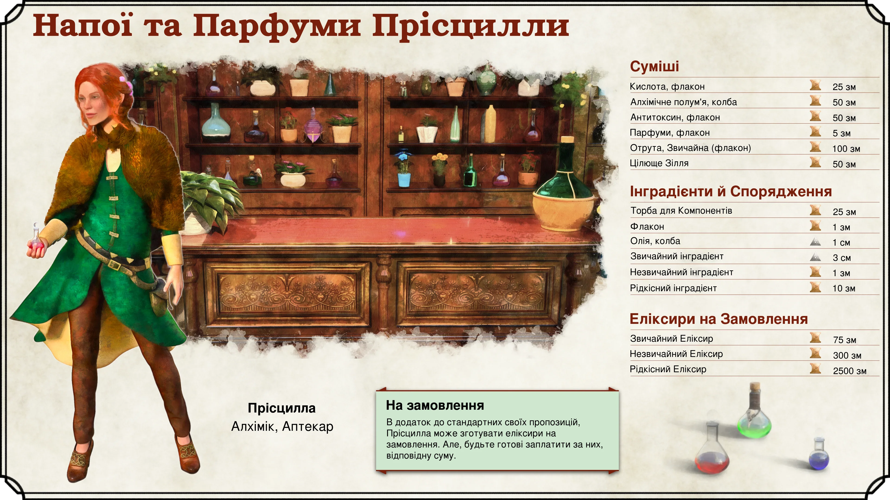
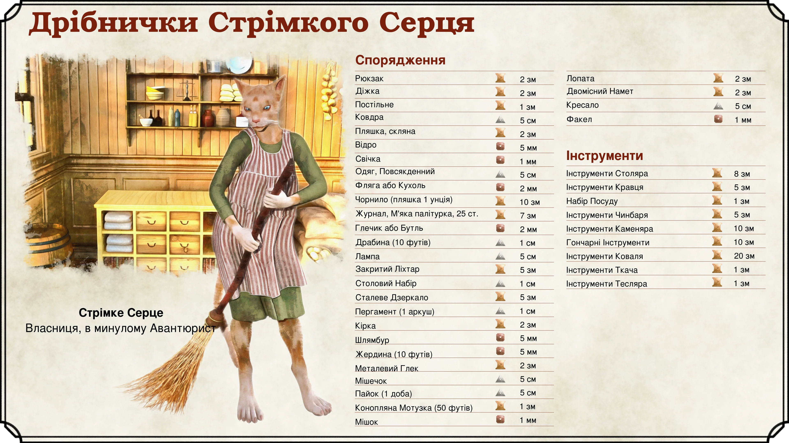
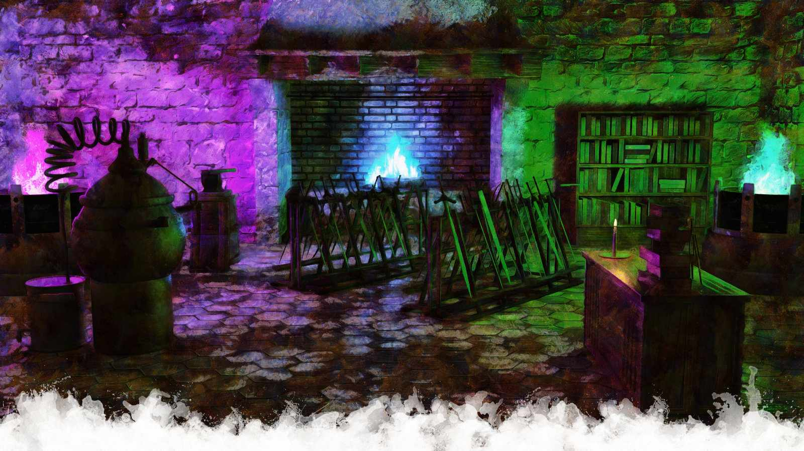
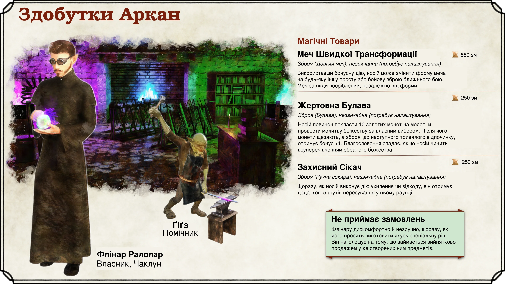

# Хоумбрю Локації

|**Хоумбрю контент**|
|---|
|Цей розділ містить неофіційні локації Невервінтера, створені для цього посібника. Кастомізуйте їх для *власних* кампаній!|
{.homebrew}

Ласкаво просимо, Майстри Підземель! Й хоча цей посібник фокусується на канонічних локаціях та історії Невервінтера, у цьому розділі йтиме мова, про нові місця, що будуть корисні Майстрам, якщо ті бажають провести пригоду в такому великому місті. Й хоча офіційні джерела пропонують багато чудових точок які можна відвідати, у них взагалі не згадуються типові заклади для рутинних потреб (принаймні, порівняно з представленими в Фандаліні).

У цьому розділі, ви знайдете крамниці де продають зброю, броню, й еліксири. Магазин загального користування, й де продають магічні предмети. Словом, усе, що можна очікувати знайти у великому місті на Фейруні. Цей розділ створено спеціально для даного посібника, тож не переймайтесь про зміну якихось деталей в своїх кампаніях, якщо вирішите ними скористатися!

Обов'язково ознайомтесь з [Додатком Б](point-of-interest-cards-page), щоб знайти картки крамниць, які можна передати вашим гравцям, коли ті їх відвідають.

{.size-full .screen-only .before-next-page-header}

### Надійний Захист Від Браннура

Браннур Лютґер, талановитий та наполегливий молодий (за мірками своєї раси) дворф. У відбудові Невервінтера він побачив для себе нагоду, та відкрив кузню в Районі Прірви, де продає інструменти, лати, великий фермерський інвентар (на приклад плуги), тощо. І хоча новостворена майстерня, на разі, пропонує лише стандартні форми броні, Браннур добре зарекомендував себе, й швидко завойовує репутацію рукастого майстра. Він навіть уклав кілька контрактів на постачання броні міській варті.

Магазин бездоганно чистий та добре організований. Представлені лати відполіровані й симетрично розташовані на стінах та стендах закладу. Якщо Браннур не за роботою у майстерні, то його можна знайти серед товарів, де він або підмітає, або чистить чи витирає свої вироби. Якщо клієнт ненароком зачепить якийсь з обладунків, що той треба буде поправити -- Браннур мимоволі смикнеться.

Браннур має спокійну та ввічливу вдачу. Більшості його клієнтів важко уявити того розгніваним чи сердитим. Це проявляється й в його праці: дворф фокусує свій хист, для створення предметів захисту й користі, й не любить створювати речі, призначених для завдання шкоди. Але, якщо й є людина, що здатна вивести Браннура з себе -- то це його сестра Бреннвін. Коли ці двоє в одній кімнаті, будьте певні, там буде гучно.

|**Натхнення для Майстра**|
|---|
|***Найкращі Матеріали***. Браннур хоче вивести свою крамницю на новий рівень. Для цього йому потрібен рідкісний матеріал чи інградієнт. Кажуть, що чимось схожим володіли Скайхолдські пірати, тож він просить партію, дістати це для нього.|
{.dmidea}

{.print-bottom-right .with-margin}

(print-page)

{.print-only .size-cover .no-margin}

{.size-full .screen-only .before-next-page-header}

### Гостре Лезо Бреннвін

Бреннвін Лютґер, сестра Браннура, також знайшла собі місце у Невервінтері. Жінка відкрила майстерню, в якій демонструє свої ковальські навички, по сусідству від свого брата, продаючи там різноманітну зброю. Як і Браннур, вона теж добре зарекомендувала себе. Її заклад став надійним джерелом озброєння для зростаючих сил оборони Невервінтера. Якось один з міських управлінців зумів розлютити і Бреннвін і Браннура, зробивши одне замовлення, на зброю й броню, гадаючи, що два їхні магазини -- одне ціле.

Й хоча Бреннвін, бракує охайності її брата, це не значить, що її роботи нижчі за якістю. Зброя, викувана руками цієї жінки, відома своєю надійністю та смертоностістю. Її мечі гості, добре збалансовані, та дуже міцні.

За характером Бреннвін, повна протилежність своєму брату. Назва "Гостре Лезо", описує не лише її вироби, але й її "Я". Кмітлива, та гостра на язик жінка не соромиться кепкувати із власних клієнтів. Ті, кого легко образити, най ліпше шукають зброю деінде.

(print-page)

{.print-only .size-cover .no-margin}

> **Суперництво Сиблінгів**
>
> Браннур та Бреннвін постійно конкурують між собою, й обидва зроблять усе можливе, аби перевершити іншого. Їх магазини стоять по сусідству, а значить, конфлікти між ними не рідкість. Деяким покупцям це на руку, й ті умисне зіштовхують їх лоб в лоб, для власного зиску. На приклад, сказавши одному з суродженців, що інший є кращим майстром, змусивши того працювати старанніше, або знизити ціну.
>
> Втім, ображати одного з них, перед іншим -- не варто. Попри ворожнечу, вони піклуються та допомагають одне одному. Не рідкість коли один з сиблінгів допомагає в майстерні іншому, позичає тому інструмент чи навіть дорогий матеріал. Дрібні чвари, відступають перед почуттям родинної єдності. Чужинць, що глузуватиме з одного із них, в кращому разі обійдеться злісним поглядом чи їдким коментарем від іншого, а в гіршому -- буде назавжди вигнаний з обох закладів, чи, навіть, викличе лють всього клану Лютґер.

(print-column)

{.size-full .screen-only .before-next-page-header}

### Напої та Парфуми Прісцилли

Напої та Парфуми Прісцилли належать молодій жінці, котра кличе себе просто "Прісцилла", без прізвища. Це красивий магазин, що розташований в Районі Синього Озера, від підлоги й до стелі заповнений полицями із живими квітами й яскравими пляшечками рідин різних кольорів. Усі шафи й столи мають вишукані форми й відполіровані до блиску. Рослин в закладі на стільки багато, що гості міста не рідко плутають його з крамницею квітів.

Попри свою назву, спеціалізацією Прісцили є не лише парфуми та напої. Дівчина -- наздвичайно талановитий алхімік та цілитель. За відповідну плату, вона здатна приготувати екзотичну чи рідкісну суміш. Вона також може здатна діагностувати хвороби, але цього не афішує й офіційно не пропонує таких послуг. Хіба якщо запитати її прямо.

Хоча Прісцила надзвичайно весела та дружелюбна -- вона уникатиме розголошення особистої інформації. Де вона навчалась, в якому віці отримала свої навички, за який кошт, в такому юному віці, відкрила свій заклад, чи бодай щось про її сім'ю -- таємниця. Хоча, якщо попитати її сусідів, то іноді, окремі мешканці Синього Озера можуть сказати, що магазин виник, немов би сам по собі, за одну ніч.

(print-page)

І хоча дівчина не так давно в місті, вона прославилася своєю благодійністю. Прісцила часто жертвує свої товари, або безкоштовно надає послуги, бідним містянам, які потребують допомоги. Вона регулярно відвідує Район Прірви, де роздає зілля й припарки хворим або пораненим.

В той же час, її крамниця вписується в мету Району Синього Озера відновити колишню дворянську естетику. Всі заможні містяни знають про "Напої та Парфуми" й постійно її відвідують. В той же час, малозабезпечені громадяни можуть і не знати про її заклад, але більшість точно впізнають саму Прісцилу, й знатимуть про її, на їх погляд, "чудодійні" ліки.

{.size-full .screen-only .before-next-page-header}

### Дрібнички Стрімкого Серця

Стрімке Серце, літня жінка Табаксі, є власником й продавцем одноіменного магазину. Ця скромна споруда, збудована на фасаді зруйнованого дому в Районі Прірви, є крамницею загальних товарів. Тут добре прибрано, пахне свіжим деревом, борошном та сушеними травами, підвішеними під стелею. Пропозиції не багаті, але заклад приємний.

Після довгих років пригод й пошуку скарбів, Стрімке Серце використала свій невеликий накопичений капітал, аби осісти та насолоджуватися пенсією. Завжди відважна, вона умисне перебралась й відкрила магазин в незнайомому місті, гадаючи, що це дозволить відчувати запал навіть на "пенсії". За час своїх мандрів, вона обжилась численними зв'язками, котрі допомогли їй відкрити свою маленьку, але прибуткову справу. Почувши що в Невервінтері роздають майже задарма, вона поспішила туди, для втілення свого задуму.

Зараз вона має спокійну та чуйну вдачу, але за нагоди розповість що в молодості була пристрасним й ризиковим шукачем пригод! Стрімке Серце із задоволенням поділиться історіями про свої небезпечні мандри дикими джунглями, наповнені гіганськими зміями та отруйними павуками, про смертельний відчай пережитий під час блукання пустельними дюнами, чи ж про роки, проведені у відкритому морі із її другом, капітаном Табаскі, Той Що Стоїть Намертво (*Stands in Tar*).

{.print-bottom-right .with-margin}

(print-page)

{.print-only .size-cover .no-margin}

{.size-full .screen-only .before-next-page-header}

### Здобутки Аркан

Здобутки Аркан -- крамниця магічної зброї та латів, що розташований у Районі Прірви. Магазин не складно знайти, оскільки той, як правило, випромінює яскраве синє, зелене, або фіолетове сяйво, із однієї з своїх численних кузень. Наблизившись до закладу, ви почуєте стукіт молота по ковальні, шипіння парових клапанів, яке лине від багатьох алхімічних приладів, чи рев, на перший погляд магічного, полум'я.

Керує магазином, ексцентричний напівельф, чаклун Флінар Ралолар. Коли він працює, то робить це тихо, з насупленим обличчям, одягаючи масивні захисні окуряли, та мантію. У нього є помічник, гоблін на ім'я Ґіґз, котрий виконує просту ковальську роботу. Втім, ніхто з відвідувачів ніколи не чув, щоб ці двоє розмовляли. А все тому, що Флінар спілкується з тим телепатично.

Вік напівельфа невідомий. Він взагалі таємнича особа, не з тих, хто відкрито ділитиметься знаннями, та ходять чутки, що до прибуття в Невервінтер, він шукав Печеру Відлуння Хвиль, неподалік Фандаліну, щоб попрацювати із Кузнею Заклинань (або, він уже там побував, якщо гравці очистили її від зловмисників).

{.print-bottom-right .with-margin}

Взагалі, не корректно назвати Флінара неприязним. Він просто дуже прямий. Його насупленість більше фізична риса обличчя, ніж свідчення настрою. Чоловік, навіть,

(print-page)

може намагатися усміхнутись чи тепло привітати клієнтів, але це виглядатиме відштовхуюче, та не щиро. Ґіґз же, якщо спробувати з ним поговорити, ніяк не реагуватиме. Хіба що може кивнути.

Здобутки Аркан пропонують різноманітну магічну зброю, лати, чи інші предмети створені в тутешніх майстернях. Зазвичай Флінар не погодиться виконати якесь замовлення чи доручення, пропонуючи, натомість, речі котрі він уже створив. Припускають, що крамниця є, насправді, дослідницькою лабораторією, а продаж речей -- лише другорядний наслідок.

Таблиця магічних предметів, які можна тут придбати:

|[D12](/roll/d10)| Магічні Предмети |
|---|---|
|**1**| **Меч Швидкої Трансформації**   *Зброя (Довгий меч), незвичайна (потребує налаштування)*  Використавши бонусну дію, носій може змінити форму меча на будь-яку іншу просту або бойову зброю ближнього бою. Меч завжди посріблений, незалежно від форми.|
|**2**| **Кольчуга Дощу**   *Обладунок (кольчужна сорочка), незвичайна (потребує налаштування)*  Якщо кольчуга мокра від дощової води -- вона додає +1 до захисту. Інакше це звичайна кольчужна сорочка.|
|**3**| **Мисливський Каптур**   *Дивовижний Предмет, незвичайна (потребує налаштування)*   Носій отримує бонус +1 до перевірок Обстеження (*Investigation*).|
|**4**| **Жертовна Булава**   *Зброя (Булава), незвичайна (потребує налаштування)*  Носій повинен покласти 10 золотих монет на молот, й провести молитву божеству за власним вибором. Після чого монети щезають, а зброя, до наступного тривалого відпочинку, отримує бонус +1. Благословення спадає, якщо носій чинить всупереч вченням обраного божества.|
|**5**| **Захисний Сікач**   *Зброя (Ручна сокира), незвичайна (потребує налаштування)*  Щоразу, як носій виконує дію ухилення чи відходу, він отримує додаткові 5 футів пересування у цьому раунді|
|**6**| **Надлегкий Лук**   *Зброя (Довгий Лук), незвичайна (потребує налаштування)*  Носій отримує бонус +1 до кидків ініціативи.|
|**7**| **Чоботи Корчмаря**   *Дивовижний Предмет, незвичайна (потребує налаштування)*  Користувач отримує бонус +1 до харизми, під час перевірок Переконання або Обману проти будь-якої істоти, кій він подав напій.|
|**8**| **Обладунок Легкого Приземлення**, *Обладунок (Шкіряний), незвичайний (потребує налаштування)*  Містить [1d4](/roll/1d4) невідновлювальних зарядів заклиннання Падіння Пера (*Feather Fal*).|
|**9**| **Жаский Кинджал**, *Зброя (Кинджал), незвичайна (потребує налаштування)*  Раз на день, носій може використати реакцію, щоб отримати +1 до захисту, й +1 до шкоди на 30 секунд (5 ходів).|
|**10**| **Вавилонська Сережка**   *Дивовижний Предмет, незвичайна (потребує налаштування)*  Містить [1d4](/roll/1d4) невідновлювальних зарядів заклинання Розуміння Мов.|
|**11**| **Тіньові Лати**   *Обладунок (Шкіряний), незвичайна (потребує налаштування)*  Від сутінків до світанку, носій отримує +1 до захисту.|
|**12**| **Перстень Відлуння**   *Дивовижний Предмет, рідкісний (потребує налаштування)*  Раз на день, носій може використати заговір Чудотворство (*Prestidigitation*).|
{.allow-breaks}
