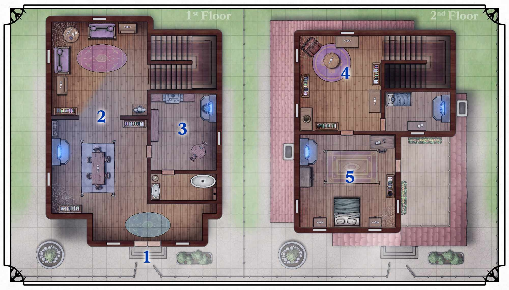

{.size-cover .print-only}

# Покинутий Таунхаус

|**Хоумбрю контент**|
|---|
|Цей розділ містить неофіційні локації Невервінтера, створені для цього посібника. Кастомізуйте їх для *власних* кампаній!|
{.homebrew}

Ця швидка пригода призначена для групи приблизно від трьох до п’яти гравців 5-го рівня.{.no-fancy}

## Преамбула

В Районі Синього Озера стоїть покинутий таунхаус. Раніше він належав Елдену Варґасу, воїну-чаклуну з Кормиру. Після того, як його дружина захворіла, він став вести справи з Ашмадаями, котрі вивезли її до Фортеці Гельма (*Helm's Hold*), а ним самим стали маніпулювати. Шукаючи ліки, Елден ставив експерименти на численних містянах, що звело їх з розуму. Зрештю, він залишив Невервінтер й відправився до Фортеці Гельма, де його, та культ, згодом зупинив Орден Позолоченого Ока (вбивши чаклуна, чи схопивши). Елден Варґас, більше ніколи не повертався до свого будинку у Невервінтері.

Перш ніж піти, аби запобігти зловмисникам, Елден запечатав свій дім магією. Місцеві вже давно поклали око на це майно, але магічний захист, до сих пір не дозволив нікому ним заволодіти.

Банда Мертвих Щурів, що оперує в міських каналах, вже давно претендує на власність. Нещодавно вони залучили одного зі своїх магів з Лускану, аби той допоміг зламати магічні замки. Таким чином, вони зможуть заволодіти реліквіями чаклуна.

## Сюжетні Зачіпки

**Чутки про багатство** 
В таверні, авантюристи почули розмову про дивний, покинутий дворянський маєток, що все ще не розграбований. У ньому повинні бути рідкісні магічні речі, котрі зможе забрати будь-хто, кому стане сміливості туди увійти.

**За дорученням** 
Багатий купець наймає авантюристів, аби ті зруйнували магічний бар'єр, який перешкоджає входу всередину. Він хотів би відремонтувати й продати споруду, але не може цього зробити.

(print-page)

## Досліджння Таунхаусу

Коли гравці підійдуть до будинку, зачитайте наступне:

> Територію будівлі оточує великий металевий паркан, втім, його ворота не замкнені. Чується завивання вітру, а небо огортається хмарами. За вийнятком зів'ялих рослин, таунхаус виглядає цілком доглянуто. Вікна випромінюють слабке синє сяйво, але вони надто брудні, щоб через них можна було щось побачити.{.read}

### 1. Екстер'єр Таунхаусу

||
|---|
|[Encounter: 2 x Wererat Assassin, 1 x Wererat Wizard](abandoned-townhouse-wererat-encounter)|
{.enemy .screen-only}

Двері в будівлю намертво замкнені. Увесь будинок захищено магією зречення, й будь-які фізичні спроби пробитися через вікна чи двері зазнають невдачі (незалежно від показника сили гравця). Елден Варґас мав на меті захистити свій дім, від простих крадіїв, доки той буде відсутній. А тому, просте заклинання [Розсіювання Магії](/spell/dispel-magic) позбавить від бар'єру усю споруду.

Як тільки гравці спробують увійти, з-за спин з'являться троє членів Метрвих Щурів (2 [Щуролаки Вбивці](/monster/wererat-assassin){.screen-only}[Щуролаки Вбивці](wererat-assassin-page){.print-only .monster}, та [Щуролак Чаклун](/monster/wererat-wizard){.screen-only}[Щуролак Чаклун](wererat-wizard-page){.print-only .monster}).

> Поки ви обдумуєте як увійти в таунхаус, троє гібридів людо-щурів входять в ворота позаду вас. Два з них одягнені в чорну шкіру й озброєні мечами й кинджалами, й один у мантії й тримає у руках сяючий посох. Один, з тих, що у шкірі, гарчить на вас: "Те, куди ви проникли, це є власніть Мертвих Щурів! Й ми вважаємо, що вам ліпше піти".{.read}

Гравці вільні їх послухати та піти. Але в цьому разі, повернувшись до власності, вони знайдуть маєток розграбованим та порожнім. Якщо ж вони відмовляться -- щуролаки на них нападуть. Якщо першими падуть Щуролаки Вбивці, Щуролак Чаклун спробує утекти. Його можна змусити розвіяти магічний бар'єр, якщо схопити живим.

### 2. Вітальня та Столова кімната

Дивне блакитне полум’я мерехтить у вогнищі, але не виділяє тепла. Стіни вистелено старою павутиною, а на кожній поверхні осів пил. Перевірка Інтилекту (Обстеження) з СК 15 на книжкових полицях допоможе знайти [Чарівний Сувій 1-го Рівня](/item/spell-scroll-1st-level){.magic-item}.

### 3. Кухня

Таке ж дивне блакитне полум'я горить і на кухні. Незважаючи на відсутність тепла, над ним "кипить" каструля з водою. Однак вода не випаровується й на дотик абсолютно холодна. Вся їжа що тут була, давно стліла у пил. Звідси можна потрапити у ванну кімнату, увійшовши в яку, купіль починає наповнюватись водою та нагріватися.

### 4. Кабінет

Під ногами у кабінеті скрипить підлога, а меблі, як і по всьому домі, вкриті шаром пилу. Рослина, в нині порожньому горщику, давно загинула й згнила. Двері у спальню (Секція 5) тихо стукають, наче всередині лишилось відкрите вікно. Перевірка Інтилекту (Обстеження) з СК 15 на книжкових полицях допоможе знайти [Чарівний Сувій 2-го Рівня](/item/spell-scroll-2nd-level){.magic-item}.

### 5. Спальня

||
|---|
|[Encounter: 1 x Storm Gyre](abandoned-townhouse-storm-gyre-encounter)|
{.enemy .screen-only}

У своїй спальні, на варті, Елден залишив [Грозовий Смерч](/monster/storm-gyre){.screen-only}[Грозовий Смерч](storm-gyre-page){.print-only .monster}. Коли гравці відкриють двері кімнати, зачитайте:

> Іскри блискавок потріскують серед закрученого виру у центрі кімнати. Якийсь час він лишається незмінним, а тоді в бурі, виникає обличчя. Кімнатою проноситься сильний вітер, змітаючи папери зі столу. А тоді, Грозовий Смерч, мчить прямо на вас!{.read}

Смерч атакує будь-яку істоту яку побачить, й буде боротися доки її не знищить. Створіння не є розумним й атакуватиме найближчого ворога. Однак, якщо декілька персонажів стоять близько один від одного, він атакує їх ланцюговою близкавкою, щоб нанести шкоду одразу кільком цілям.

Після битви, гравці можуть обшукати шафу й знайти там випадковий предмет з [Таблиці Магічних Предметів Б](https://dungeonmastertools.github.io/) з Посібника Майстра Підземель. На столі прикріплено записку з текстом:

> Моя найдорожна Каріс, якщо ти це читаєш -- знай: мені щиро шкода. - **Елден** {.paper}
